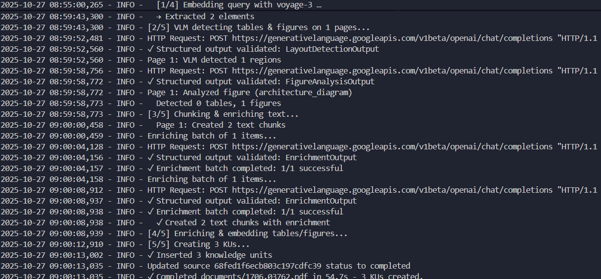
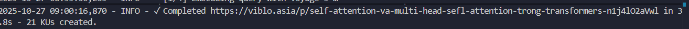
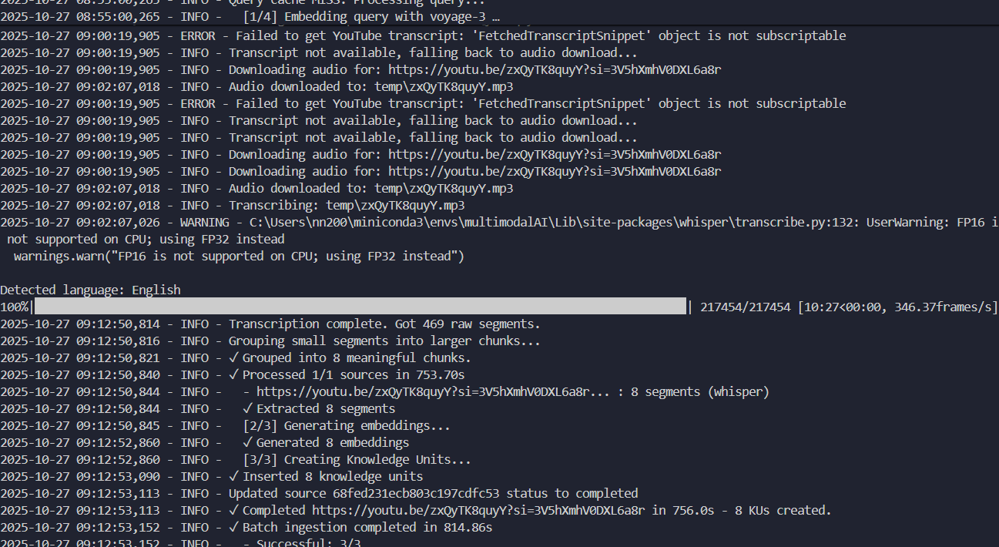
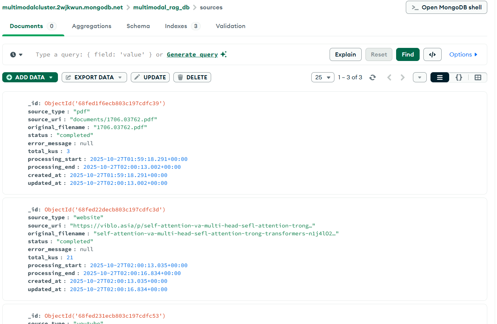
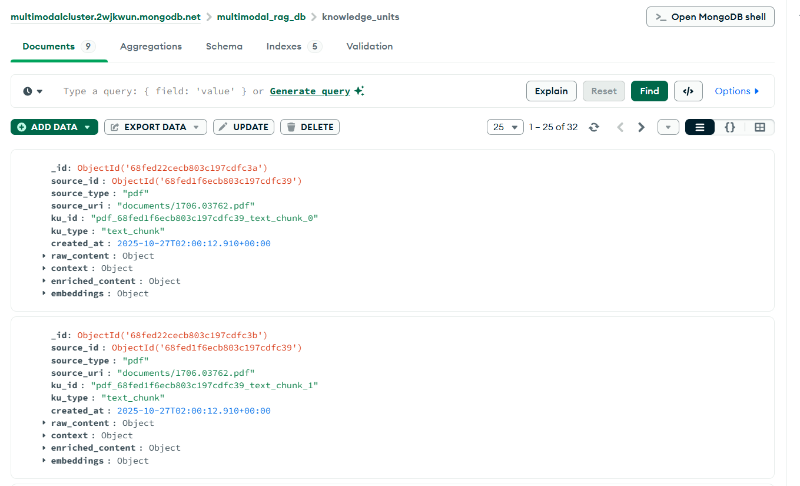
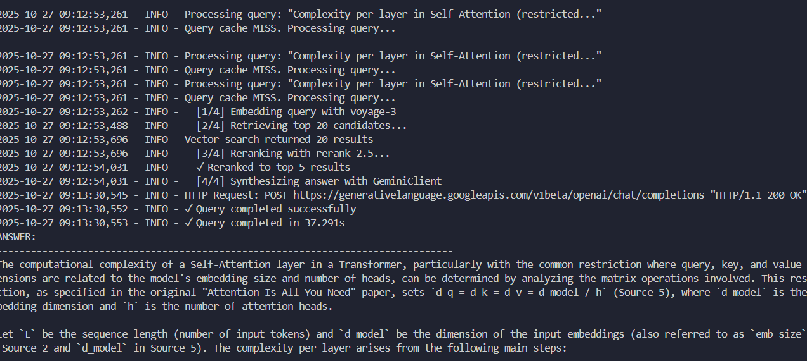
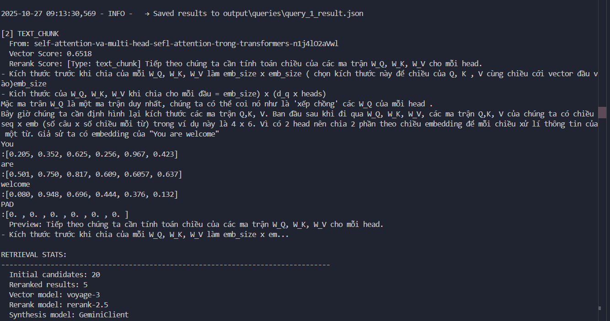

# Multimodal RAG — Local Runner

This repository contains an experimental research & development pipeline for a multimodal Retrieval-Augmented Generation (RAG) system. It supports ingesting PDFs (text, tables, figures), extracting structured layout with a VLM, falling back to pdfplumber for table extraction, enriching content with a structured LLM (Gemini), and creating text or multimodal embeddings (Voyage multmodal models). Knowledge units (KUs) are stored in MongoDB and can be queried with vector + hybrid search.

Key features
- PDF extraction: text, table, figure extraction via VLM with pdfplumber fallback for tables
- Figure analysis: image analysis text is captured and included in multimodal embeddings so the analysis is retrievable by queries
- Embeddings: text and multimodal embeddings with metadata (model name and embedding type) stored per KU
- Gemini structured completions: Pydantic schemas converted to JSON Schema and patched to be accepted by the API
- Resilient ingestion: unordered bulk inserts with duplicate-key handling

Who is this for
- Engineers and researchers who want a locally runnable multimodal RAG research pipeline that integrates VLM layout parsing, structured LLM enrichments, and multimodal embeddings.

Requirements
- Python 3.11
- MongoDB (Atlas or local) — a vector index is required if you want to use MongoDB vector search
- API keys for external services you intend to use (Voyage AI, Gemini, etc.)

Quick setup: See detail in QUICKSTART.md

Configuration: 

PDF process: 
- Text -> extract all -> chunk
- Figure -> parser -> extract -> analysis (enrich) -> multimodal embedding
- Table -> parser -> extract

Website: extract -> text chunk

Youtube link/video: extract through api transcript/ fall back download video -> STT model -> transcript -> text chunk

Storage MongoDB:
- source collection:

- Knowledged unit collection:

Query:

Notes about the current codebase
- Table extraction: the pipeline first uses the VLM to extract tables; when that fails or returns empty, a pdfplumber fallback is attempted.
- VLMs aren’t very good at extracting complex tables. For harder cases, should combine them with OCR to improve text and layout accuracy.
- Thầy thông cảm vì nhiều thành viên lạ tên trên github ạ, do em dùng máy khác nên v.

Future Improvements
- Enhance layout and parser extraction
- Define stricter schemas and validation
- Refactor and clean up codebase
- Fix automatic extract youtube transcript (faster than using whisper -> transcript)
- Enhance visual-language queries
